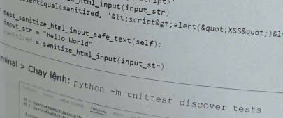
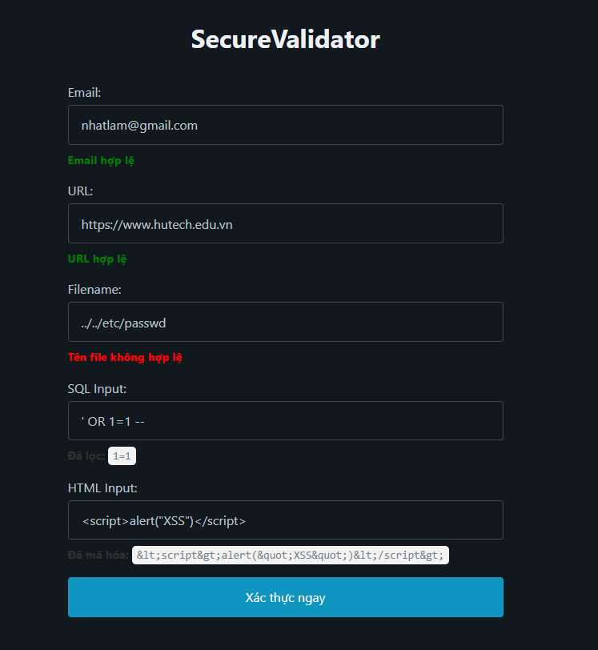
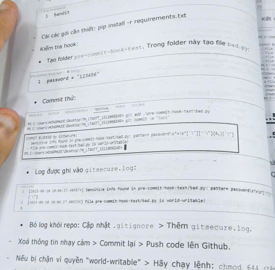
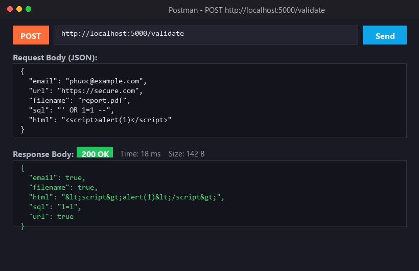
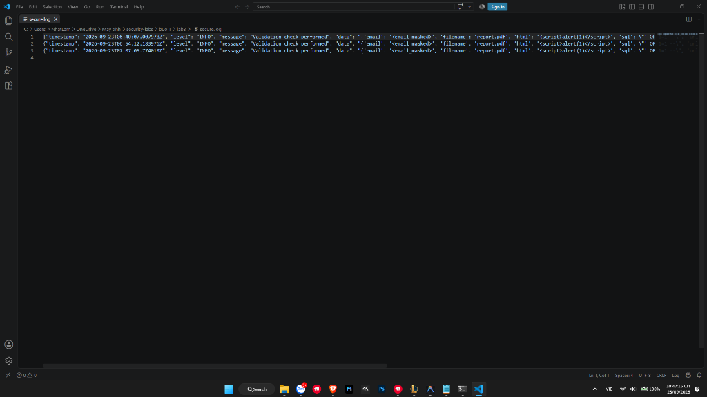

# Báo cáo thực hành Buổi 1: Cơ sở lập trình bảo mật

- Sinh viên: Nguyễn Nhật Lâm
- Môn học: Lập trình an toàn / Bảo mật ứng dụng

---

## 1. Cấu trúc thư mục buổi 1

```text
buoi1/
├── README.md               # Báo cáo tổng hợp buổi 1 kèm ảnh minh chứng
├── images/                 # Ảnh chụp các kết quả kiểm thử bảo mật (Key tests)
│   ├── lab1_unittest_result.png
│   ├── lab1_web_test_result.png
│   ├── lab2_hook_blocked.png
│   ├── lab3_postman_api.png
│   └── lab3_response_and_log.png
├── lab1/                   # Lab 1: Kiểm tra và làm sạch dữ liệu đầu vào
│   ├── app.py
│   ├── requirements.txt
│   ├── render.yaml
│   ├── securevalidator/
│   │   ├── __init__.py
│   │   └── core.py
│   ├── templates/
│   │   └── index.html
│   └── tests/
│       └── test_validators.py
├── lab2/                   # Lab 2: Git Security Hook
│   ├── requirements.txt
│   ├── .githooks/
│   │   └── pre-commit
│   └── pre-commit-hook-test/
│       └── bad.py
└── lab3/                   # Lab 3: Hệ thống Secure Logger
    ├── app.py
    ├── requirements.txt
    ├── securevalidator/
    │   ├── __init__.py
    │   └── core.py
    ├── securelogger/
    │   ├── __init__.py
    │   └── logger.py
    └── tests/
        └── test_logger.py
```

---

## 2. Lab 1: Kiểm tra và làm sạch dữ liệu đầu vào (Input Validation & Sanitization)

### 2.1. Mục tiêu
Áp dụng nguyên tắc kiểm tra nghiêm ngặt dữ liệu đầu vào trước khi ứng dụng xử lý, ngăn ngừa các lỗ hổng phổ biến trong OWASP Top 10 như SQL Injection, Cross-Site Scripting (XSS), Directory Traversal và SSRF.

### 2.2. Chi tiết thực hiện (`lab1/securevalidator/core.py`)
- **Kiểm tra email (`validate_email`)**: Sử dụng biểu thức chính quy kiểm tra định dạng email và loại trừ trường hợp chứa hai dấu chấm liên tiếp (`..`).
- **Kiểm tra URL (`validate_url`)**: Phân tách URL bằng `urllib.parse`, chỉ chấp nhận giao thức an toàn `http`/`https` và bắt buộc có domain hợp lệ để phòng chống tấn công SSRF cơ bản.
- **Kiểm tra tên file (`validate_filename`)**: Chặn các chuỗi leo thang thư mục như `..`, `/`, `\\` và so sánh `os.path.basename(filename) == filename` để chống Path Traversal.
- **Làm sạch SQL (`sanitize_sql_input`)**: Loại bỏ các ký tự bẻ gãy câu lệnh (`'`, `"`, `;`, `--`, `#`) và các từ khóa truy vấn nhạy cảm (`SELECT`, `INSERT`, `UPDATE`, `DELETE`, `DROP`, `OR`, `AND`, `UNION`, `WHERE`).
- **Mã hóa HTML (`sanitize_html_input`)**: Dùng `html.escape` chuyển đổi các ký tự đặc biệt `<`, `>`, `&`, `"` thành HTML entities, ngăn chặn trình duyệt thực thi JavaScript độc hại.

### 2.3. Hình ảnh kiểm thử và giải thích chi tiết

#### a. Kiểm thử tự động (Unit Test):
Chạy lệnh `python -m unittest discover tests`, toàn bộ các bài test kiểm tra dữ liệu hợp lệ và dữ liệu tấn công đều đạt kết quả `OK`:



*Giải thích*: Bộ test kiểm tra 10 kịch bản, bao gồm kiểm tra email sai định dạng, URL dùng giao thức không an toàn (`ftp://`), đường dẫn chứa ký tự điều hướng (`../../etc/passwd`) và các chuỗi chèn mã độc.

#### b. Kiểm thử trên giao diện Web (`http://127.0.0.1:5000`):
Tiến hành nhập đồng thời 5 trường dữ liệu mẫu để kiểm tra cơ chế phòng thủ:



*Giải thích chi tiết từng kết quả*:
1. **Email (`nhatlam@gmail.com`)**: Hiển thị **"Email hợp lệ"** (màu xanh) do chuỗi khớp hoàn toàn với mẫu regex.
2. **URL (`https://www.hutech.edu.vn`)**: Hiển thị **"URL hợp lệ"** (màu xanh) do sử dụng giao thức HTTPS và có domain rõ ràng.
3. **Filename (`../../etc/passwd`)**: Hiển thị **"Tên file không hợp lệ"** (màu đỏ). Hệ thống phát hiện chuỗi `..` và `/` của kỹ thuật Path Traversal nhằm đọc trộm file cấu hình Linux, kịp thời từ chối xử lý.
4. **SQL Input (`' OR 1=1 --`)**: Hiển thị kết quả **"Đã lọc: 1=1"**. Dấu nháy đơn `'`, từ khóa `OR` và phần chú thích `--` đã bị cắt bỏ hoàn toàn, vô hiệu hóa kịch bản bypass authentication.
5. **HTML Input (`<script>alert("XSS")</script>`)**: Hiển thị **"Đã mã hóa: `&lt;script&gt;alert(&quot;XSS&quot;)&lt;/script&gt;`"**. Các thẻ HTML đã được escape thành text thuần, trình duyệt hiển thị an toàn và không bị nổ popup script.

---

## 3. Lab 2: Cấu hình Git Security Hook

### 3.1. Mục tiêu
Thiết lập Git Pre-commit Hook tự động quét mã nguồn ở tầng client trước khi commit, ngăn chặn tình trạng vô tình đẩy các thông tin nhạy cảm (passwords, API keys, private tokens, AWS access keys) lên GitHub.

### 3.2. Chi tiết thực hiện (`lab2/.githooks/pre-commit`)
- Đăng ký thư mục hook với Git:
  ```bash
  git config core.hooksPath buoi1/lab2/.githooks
  ```
- Hook tự động lấy danh sách file đang stage (`git diff --cached --name-only`) và đối soát với danh sách mẫu regex bí mật (`SENSITIVE_PATTERNS`).
- Nếu phát hiện vi phạm, hook trả về mã lỗi `sys.exit(1)`, hủy bỏ lệnh commit và ghi log vào tệp `gitsecure.log`.

### 3.3. Hình ảnh kiểm thử và giải thích chi tiết

Tạo file `pre-commit-hook-test/bad.py` chứa biến `chuoi mat khau thu nghiem`. Khi chạy lệnh `git add` và thực hiện `git commit -m "test"`:



*Giải thích chi tiết*:
- Terminal thông báo rõ: **`COMMIT BLOCKED by GitSecure`**.
- Phát hiện tệp `bad.py` vi phạm mẫu mật khẩu: `pattern password\s*[:=]\s*...`.
- Git tự động hủy commit, ngăn không cho mật khẩu bị đưa vào lịch sử commit của repository.
- Vi phạm được ghi lại trong `gitsecure.log` để phục vụ audit.

---

## 4. Lab 3: Xây dựng hệ thống Secure Logger

### 4.1. Mục tiêu
Xây dựng module ghi log an toàn cho ứng dụng Flask, đáp ứng 4 tiêu chuẩn bảo mật nhật ký: che giấu dữ liệu định danh cá nhân (PII), chống tấn công Log Injection, xác thực tính toàn vẹn (Tamper Detection) và tự động xoay vòng nén log (Log Rotation).

### 4.2. Chi tiết thực hiện (`lab3/securelogger/logger.py`)
- **Che giấu PII (`mask_pii`)**: Tự động nhận diện Email và Password/Token trong nội dung log và thay thế bằng `<email_masked>`, `<token_masked>`.
- **Định dạng JSON một dòng (`JSONFormatter`)**: Ngăn chặn kẻ tấn công chèn ký tự xuống dòng `\r\n` để tạo log giả mạo.
- **Xác thực toàn vẹn bằng SHA-256 (`append_signature`)**: Mỗi dòng log khi ghi vào `secure.log` sẽ đồng thời được băm SHA-256 và lưu vào file `secure.log.sig`.
- **Quản lý dung lượng (`GZipRotator`)**: Luân phiên file log khi đạt dung lượng 1MB và nén thành dạng `.gz`.

### 4.3. Hình ảnh kiểm thử và giải thích chi tiết

#### a. Kiểm thử API qua Postman:
Gửi request `POST http://localhost:5000/validate` với body JSON chứa thông tin email và các payload thử nghiệm:



#### b. Kết quả Response và kiểm tra tệp `secure.log`:



*Giải thích chi tiết*:
- **Phản hồi API**: Trả về mã HTTP 200 kèm JSON kết quả đã qua bộ lọc an toàn (`"sql": "1=1"`, `"html": "&lt;script&gt;..."`).
- **Nội dung tệp `secure.log`**: Địa chỉ email thực tế của người dùng đã tự động được che giấu thành **`'email': '<email_masked>'`**, bảo vệ an toàn thông tin định danh cá nhân (PII).
- **Tệp chữ ký `secure.log.sig`**: Chứa chuỗi mã băm SHA-256 đối soát cho từng dòng log. Nếu bất kỳ ai can thiệp chỉnh sửa file `secure.log`, việc so khớp mã băm sẽ lập tức phát hiện sự sai lệch.
