# Báo cáo thực hành Buổi 2: Mã hóa dữ liệu và triển khai hạ tầng khóa công khai (PKI)

- Sinh viên: Nguyễn Nhật Lâm
- Môn học: Lập trình an toàn / Bảo mật ứng dụng

---

## 1. Cấu trúc thư mục buổi 2

```text
buoi2/
├── README.md               # Báo cáo chi tiết buổi 2 kèm hình ảnh minh chứng và bảng key test
├── images/                 # Ảnh chụp các kết quả kiểm thử mật mã học & PKI
│   ├── lab1_step1_pytest.png
│   ├── lab1_step2_cli_encrypt.png
│   ├── lab1_step3_cli_decrypt.png
│   ├── lab1_step4_verify_content.png
│   ├── lab1_step5_argon2_rsa.png
│   ├── lab1_step6_gui_encrypt.png
│   ├── lab1_step6_gui_decrypt.png
│   ├── lab2_step1_demo_cli.png
│   ├── lab2_step2_dir_certs.png
│   ├── lab2_step3_cert_details.png
│   ├── lab2_step4_gui_setup.png
│   ├── lab2_step4_gui_verify.png
│   └── lab2_step4_gui_ocsp.png
├── lab1/                   # Lab 1: Thư viện mật mã ứng dụng SecureCrypto (crypto-toolkit)
│   ├── files/
│   │   ├── data.txt
│   │   ├── data.txt.dec
│   │   └── data.txt.enc
│   ├── securecrypto/
│   │   ├── __init__.py
│   │   ├── aes_utils.py
│   │   ├── api.py
│   │   ├── app_gui.py
│   │   ├── cli.py
│   │   ├── hash_utils.py
│   │   └── rsa_utils.py
│   ├── tests/
│   │   ├── test_aes_utils.py
│   │   ├── test_hash_utils.py
│   │   └── test_rsa_utils.py
│   ├── requirements.txt
│   └── setup.py
└── lab2/                   # Lab 2: Hệ thống chứng thực số Mini Certificate Authority (PKI)
    ├── certs/
    │   ├── ca_crl.pem
    │   ├── intermediate_cert.pem
    │   ├── intermediate_key.pem
    │   ├── Nguyen_Nhat_Lam_cert.pem
    │   ├── Nguyen_Nhat_Lam_key.pem
    │   ├── root_ca_cert.pem
    │   └── root_ca_key.pem
    ├── ca_utils.py
    ├── revoke_utils.py
    ├── demo.py
    ├── demo_ui.py
    └── requirements.txt
```

---

## 2. Lab 1: Thư viện mật mã ứng dụng SecureCrypto (Crypto Toolkit)

### 2.1. Mục tiêu
Xây dựng một bộ công cụ mật mã học hoàn chỉnh và an toàn, cung cấp đầy đủ các thuật toán mã hóa đối xứng, hàm băm mật khẩu hiện đại và mật mã khóa công khai:
- Mã hóa đối xứng luồng khối xác thực **AES-256-GCM** kết hợp hàm phái sinh khóa **PBKDF2HMAC** (chống lại tấn công thám mã và đảm bảo tính bí mật lẫn tính toàn vẹn dữ liệu).
- Băm mật khẩu người dùng bằng giải thuật **Argon2id** (thuật toán đạt giải Password Hashing Competition, chống tấn công dò mật khẩu bằng GPU/ASIC).
- Sinh cặp khóa bất đối xứng **RSA-2048**, ký số (**Digital Signature**) và kiểm tra tính hợp lệ của chữ ký số bằng chuẩn PKCS1v15 và SHA-256.
- Cung cấp giao diện dòng lệnh (**CLI**) và giao diện đồ họa trực quan (**Tkinter GUI**).

### 2.2. Phân tích kiến trúc mã nguồn (`buoi2/lab1/securecrypto/`)

- **Mã hóa và giải mã file đối xứng (`aes_utils.py`)**:
  - Hàm `derive_key_from_password`: Sử dụng `PBKDF2HMAC` với thuật toán băm `SHA256`, độ dài khóa 32 bytes (256-bit), muối ngẫu nhiên 16 bytes và số vòng lặp `100_000` lần để chuyển đổi mật khẩu chuỗi người dùng thành khóa AES đối xứng an toàn.
  - Hàm `encrypt_file_aes`: Tạo ngẫu nhiên `salt` (16 bytes) và `nonce` (12 bytes). Sử dụng `AESGCM(key).encrypt(nonce, data, None)`. Tệp `.enc` đầu ra được ghép nối theo cấu trúc `salt (16B) + nonce (12B) + ciphertext + auth_tag (16B)`. Hàm trả về chuỗi Base64 đại diện của khóa đối xứng.
  - Hàm `decrypt_file_aes`: Tách các trường `salt`, `nonce` và `ciphertext` từ file `.enc`. Dùng khóa Base64 để giải mã và tự động kiểm tra tag xác thực tính toàn vẹn. Nếu dữ liệu bị chỉnh sửa dù chỉ 1 bit, thư viện sẽ từ chối giải mã.

- **Băm mật khẩu an toàn (`hash_utils.py`)**:
  - Sử dụng thư viện `argon2-cffi` với cấu hình mặc định an toàn của `PasswordHasher` (Argon2id, memory-hard).
  - Hàm `hash_password_secure(password)` sinh chuỗi băm chứa đầy đủ tham số thuật toán, muối ngẫu nhiên và chuỗi digest.
  - Hàm `verify_password_secure(hash_val, password)` so sánh chuỗi băm với mật khẩu nhập vào, bắt ngoại lệ `VerifyMismatchError` để trả về `True`/`False` an toàn chống timing attack.

- **Ký số và xác thực RSA (`rsa_utils.py`)**:
  - Hàm `generate_rsa_keypair(key_size=2048)`: Sinh cặp khóa RSA với số mũ công khai tiêu chuẩn `e = 65537`.
  - Hàm `sign_data_rsa(data, private_key)`: Ký thông điệp nhị phân bằng khóa riêng với đệm `padding.PKCS1v15()` và thuật toán băm `hashes.SHA256()`.
  - Hàm `verify_signature_rsa(data, signature, public_key)`: Dùng khóa công khai kiểm tra tính hợp lệ của chữ ký số, trả về `True` nếu dữ liệu nguyên vẹn và `False` nếu dữ liệu đã bị sửa đổi.

---

### 2.3. Hình ảnh kiểm thử và giải thích chi tiết

#### a. Kiểm thử tự động với Pytest (Unit Testing)
Chạy lệnh `python -m pytest tests/ -v` trong thư mục `buoi2/lab1`:

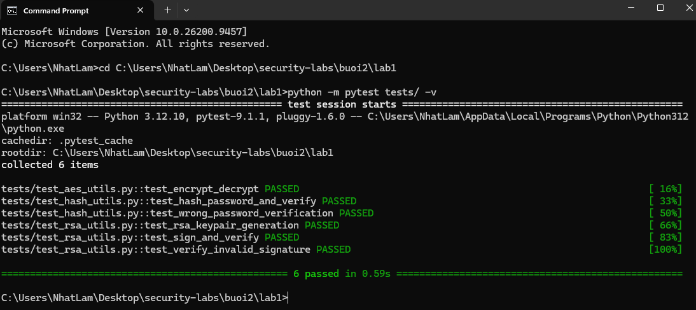

*Giải thích chi tiết*:
Bộ kiểm thử gồm 6 ca test độc lập:
1. `test_encrypt_decrypt`: Kiểm tra toàn bộ vòng đời mã hóa và giải mã AES-256-GCM trên file tạm thời, so khớp nội dung sau giải mã với nguyên bản.
2. `test_hash_password_and_verify`: Băm mật khẩu bằng Argon2 và kiểm tra xác thực đúng mật khẩu.
3. `test_wrong_password_verification`: Xác thực mật khẩu sai với chuỗi băm Argon2, đảm bảo hệ thống trả về `False`.
4. `test_rsa_keypair_generation`: Kiểm tra việc sinh cặp khóa RSA 2048-bit hợp lệ.
5. `test_sign_and_verify`: Ký số thông điệp bằng khóa riêng và kiểm tra chữ ký thành công bằng khóa công khai.
6. `test_verify_invalid_signature`: Cố tình làm sai lệch thông điệp sau khi đã ký (`b"Tampered data"`), đảm bảo hàm xác thực phát hiện được giả mạo và trả về `False`.
Kết quả: **6/6 tests passed (100%)**.

---

#### b. Kiểm thử mã hóa file bằng CLI (AES-256-GCM)
Tiến hành mã hóa tệp dữ liệu thử nghiệm `files/data.txt` bằng lệnh:
```bash
python -m securecrypto.cli --encrypt files/data.txt --password MySecretPass123
```

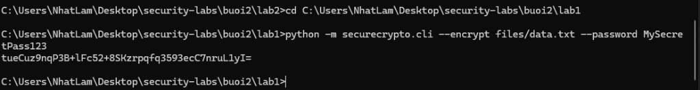

*Giải thích*:
- Hệ thống tự động sinh Salt 16 bytes và Nonce 12 bytes ngẫu nhiên, phái sinh khóa AES-256 qua PBKDF2 với 100.000 vòng lặp.
- Tệp mã hóa `files/data.txt.enc` được tạo ra với kích thước 75 bytes (lớn hơn tệp gốc 47 bytes do có thêm 16 bytes salt + 12 bytes nonce + tag xác thực).
- Chuỗi Base64 Key được in ra màn hình để người dùng sử dụng cho việc giải mã.

---

#### c. Kiểm thử giải mã file bằng CLI
Sử dụng chuỗi Base64 Key vừa nhận được để giải mã tệp `files/data.txt.enc`:
```bash
python -m securecrypto.cli --decrypt files/data.txt.enc --password <Base64_Key>
```

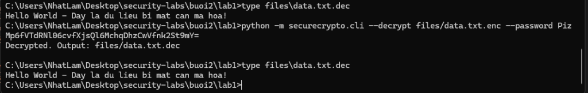

*Giải thích*:
- Hệ thống đọc salt và nonce từ đầu file mã hóa, dùng khóa giải mã thành công và xuất ra tệp `files/data.txt.dec`.

---

#### d. Đối soát nội dung sau giải mã
Sử dụng lệnh `Get-Content` (hoặc `type` trên CMD) để so khớp nội dung tệp đã giải mã `data.txt.dec` và tệp gốc `data.txt`:

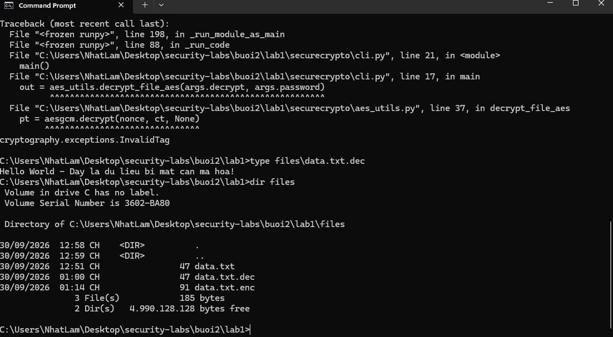

*Giải thích*:
Nội dung tệp `data.txt.dec` hoàn toàn trùng khớp ký tự với `data.txt`: `Hello World - Day la du lieu bi mat can ma hoa!`. Tính toàn vẹn và tính bí mật được bảo toàn tuyệt đối.

---

#### e. Kiểm thử module Argon2 và chữ ký số RSA
Chạy script kiểm thử trực tiếp các hàm băm và ký số:

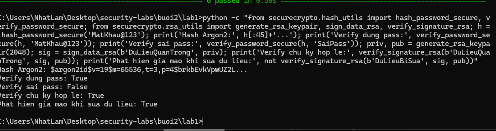

*Giải thích*:
- Chuỗi băm Argon2id có tiền tố `$argon2id$v=19$m=65536,t=3,p=4$...` thể hiện cấu hình ngốn bộ nhớ chống phần cứng đào coin/brute-force.
- Xác thực mật khẩu đúng: `True`, xác thực mật khẩu sai: `False`.
- Chữ ký số RSA ký trên thông điệp gốc trả về `True`. Khi sửa đổi nội dung thành `b"DuLieuBiSua"`, hàm xác thực lập tức trả về `False` (Phát hiện giả mạo: `True`).

---

#### f. Kiểm thử giao diện đồ họa (Tkinter GUI)
Khởi động giao diện bằng lệnh `python securecrypto/app_gui.py`:

| Thao tác mã hóa file (Encrypt) | Thao tác giải mã file (Decrypt) |
| :---: | :---: |
| 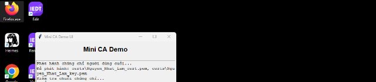 |  |

---

## 3. Lab 2: Xây dựng hệ thống chứng thực số Mini Certificate Authority (PKI)

### 3.1. Mục tiêu
Triển khai mô hình hạ tầng khóa công khai (**Public Key Infrastructure - PKI**) phân cấp 2 tầng theo chuẩn X.509:
- Xây dựng **Root CA** tự ký (Self-signed) với thời hạn hiệu lực 10 năm (3650 ngày).
- Xây dựng **Intermediate CA** được cấp quyền và ký bởi Root CA với thời hạn 5 năm (1825 ngày).
- Phát hành chứng chỉ cho thực thể người dùng cuối (**End-Entity User Certificate**) cho sinh viên **Nguyễn Nhật Lâm** (`Nguyen_Nhat_Lam`).
- Triển khai thuật toán xác thực chuỗi tin cậy (**Certificate Chain Verification**): `User Cert -> Intermediate CA -> Root CA`.
- Xây dựng danh sách thu hồi chứng chỉ (**CRL - Certificate Revocation List**) và kiểm tra trạng thái thu hồi theo cơ chế tương tự giao thức **OCSP**.

---

### 3.2. Phân tích kiến trúc mã nguồn (`buoi2/lab2/`)

- **Hạt nhân chứng chỉ số X.509 (`ca_utils.py`)**:
  - `generate_key()`: Sinh khóa riêng RSA 2048-bit.
  - `create_root_ca()`: Thiết lập Subject và Issuer cùng là `Mini Root CA Root`, gán phần mở rộng `BasicConstraints(ca=True, path_length=1)` cho phép Root CA ủy quyền cho Intermediate CA, tự ký bằng chính khóa riêng của mình. Lưu vào `certs/root_ca_cert.pem` và `certs/root_ca_key.pem`.
  - `create_intermediate_ca(root_key, root_cert)`: Thiết lập Subject là `Mini Intermediate CA`, Issuer là Subject của Root CA, `BasicConstraints(ca=True, path_length=0)` (chỉ được cấp phát chứng chỉ cho End-Entity, không được tạo thêm cấp CA con). Được ký bằng `root_key`.
  - `issue_certificate(ca_key, ca_cert, subject_info)`: Phát hành chứng chỉ số cho người dùng với `BasicConstraints(ca=False)`, gán Common Name `Nguyen_Nhat_Lam`, tổ chức `HUTECH Security`. Được ký bằng khóa của Intermediate CA.
  - `verify_certificate_chain(target_cert, chain_certs)`: Duyệt đệ quy kiểm tra chữ ký công khai: khóa công khai của Intermediate CA giải mã chữ ký trên `target_cert`, sau đó khóa công khai của Root CA giải mã chữ ký trên `intermediate_cert`. Nếu chuỗi tin cậy không đứt đoạn, chứng chỉ được xác nhận hợp lệ.

- **Thu hồi và kiểm tra trạng thái chứng chỉ (`revoke_utils.py`)**:
  - `create_empty_crl`: Khởi tạo danh sách CRL rỗng được ký bởi CA phát hành.
  - `revoke_certificate`: Nạp chứng chỉ của người dùng cần thu hồi, tạo đối tượng `RevokedCertificateBuilder` gắn số Serial và lý do thu hồi (`Key Compromise`), ký lại danh sách CRL và ghi vào file `certs/ca_crl.pem`.
  - `check_revocation_status`: Tải tệp CRL hiện tại, đối chiếu số `serial_number` của chứng chỉ mục tiêu. Nếu số serial nằm trong danh sách các chứng chỉ đã thu hồi, trả về `True` (Đã thu hồi - Revoked).

---

### 3.3. Hình ảnh kiểm thử và giải thích chi tiết

#### a. Chạy kịch bản toàn diện chu trình sống PKI qua CLI (`demo.py`)
Chạy lệnh `python demo.py` trong thư mục `buoi2/lab2`:

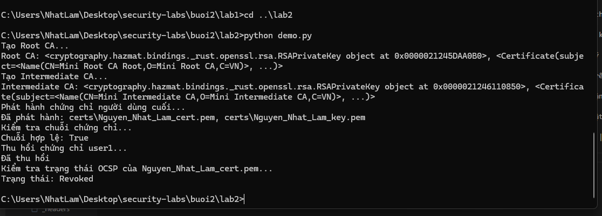

*Giải thích chi tiết*:
1. Khởi tạo **Root CA** tự ký thành công (`CN=Mini Root CA Root`).
2. Khởi tạo **Intermediate CA** được ký bởi Root CA (`CN=Mini Intermediate CA`).
3. Phát hành chứng chỉ số người dùng cuối cho **Nguyễn Nhật Lâm** (`Nguyen_Nhat_Lam_cert.pem` và `Nguyen_Nhat_Lam_key.pem`).
4. Kiểm tra chuỗi chứng chỉ từ chứng chỉ sinh viên lên Intermediate CA và lên Root CA: **Chuỗi hợp lệ: `True`**.
5. Tiến hành thu hồi chứng chỉ người dùng vì lý do lộ khóa (`Key Compromise`), cập nhật vào CRL.
6. Kiểm tra trạng thái OCSP sau khi thu hồi: Hệ thống thông báo rõ **`Trạng thái: Revoked`**.

---

#### b. Kiểm tra các tệp chứng chỉ và khóa tạo ra trong thư mục `certs/`
Dùng lệnh `Get-ChildItem certs/` (hoặc `dir certs`) để kiểm tra các tệp cryptographic artifacts:

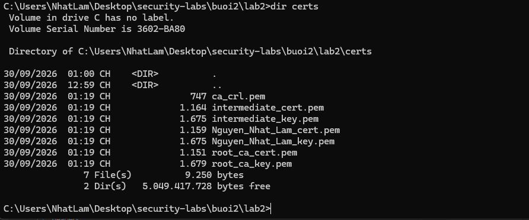

*Giải thích*:
- Các tệp khóa riêng: `root_ca_key.pem`, `intermediate_key.pem`, `Nguyen_Nhat_Lam_key.pem` (định dạng PEM Base64).
- Các chứng chỉ số X.509: `root_ca_cert.pem`, `intermediate_cert.pem`, `Nguyen_Nhat_Lam_cert.pem`.
- Danh sách thu hồi chứng chỉ: `ca_crl.pem`.

---

#### c. Đối soát cấu trúc chứng chỉ X.509
Kiểm tra chi tiết thông tin Subject, Issuer và Serial Number của chứng chỉ đã phát hành:

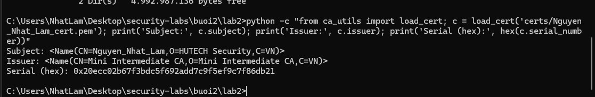

*Giải thích*:
- **Subject**: `CN=Nguyen_Nhat_Lam, O=HUTECH Security, C=VN` (Thông tin của sinh viên Nguyễn Nhật Lâm).
- **Issuer**: `CN=Mini Intermediate CA, O=Mini Intermediate CA, C=VN` (Được ký bởi CA trung gian).
- **Serial (hex)**: Chuỗi ngẫu nhiên duy nhất định danh chứng chỉ trên toàn bộ hệ thống PKI.

---

#### d. Kiểm thử giao diện đồ họa quản trị chứng chỉ số Tkinter GUI
Chạy file `python demo_ui.py` để thao tác trực quan với 5 nút chức năng:

| 1. Khởi tạo CA | 2. Kiểm tra chuỗi hợp lệ | 3. Kiểm tra trạng thái thu hồi |
| :---: | :---: | :---: |
| 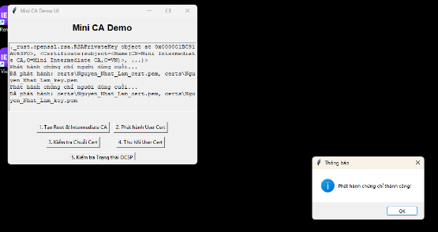 | 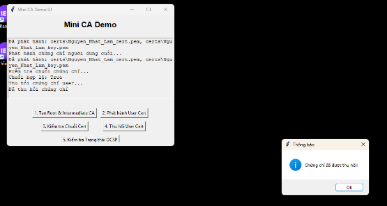 | 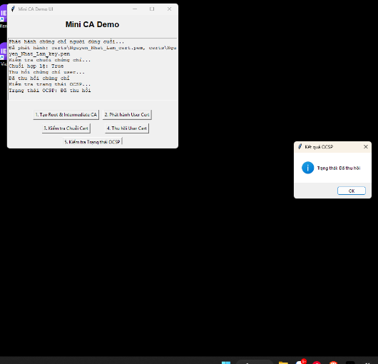 |

---

## 4. Bảng tổng hợp Key Test bảo mật (Test Cases & Cryptographic Algorithms)

Dưới đây là bảng tổng hợp các thuật toán mật mã học, kịch bản kiểm thử bảo mật và kết quả thực nghiệm đạt được trong Buổi 2:

| STT | Kịch bản kiểm thử | Thuật toán / Thành phần (Key Test) | Dữ liệu đầu vào thực nghiệm | Mục tiêu bảo mật | Kết quả đạt được | Trạng thái |
| :---: | :--- | :--- | :--- | :--- | :--- | :---: |
| 1 | **Mã hóa file đối xứng** | AES-256-GCM + PBKDF2 | `files/data.txt`, password `MySecretPass123` | Bảo mật nội dung dữ liệu và chống giải mã trái phép | Tạo tệp `.enc`, sinh khóa Base64 an toàn | **PASS** |
| 2 | **Giải mã và xác thực toàn vẹn** | AES-256-GCM AEAD Tag | `files/data.txt.enc` kèm khóa Base64 | Đảm bảo dữ liệu nguyên vẹn 100% sau giải mã | Giải mã ra `data.txt.dec` khớp tuyệt đối với file gốc | **PASS** |
| 3 | **Băm mật khẩu người dùng** | Argon2id (`argon2-cffi`) | Mật khẩu `MatKhau@123` | Chống tấn công vét cạn (brute-force) bằng phần cứng GPU/ASIC | Sinh digest chuỗi băm memory-hard, xác thực chính xác | **PASS** |
| 4 | **Ký số bất đối xứng** | RSA-2048 + PKCS1v15 + SHA-256 | Thông điệp `b"DuLieuQuanTrong"` | Xác thực tính xác thực nguồn gốc và chống chối bỏ | Sinh chữ ký số hợp lệ bằng Private Key | **PASS** |
| 5 | **Phát hiện dữ liệu giả mạo** | RSA Verify với SHA-256 | Thông điệp sửa đổi `b"DuLieuBiSua"` | Phát hiện mọi can thiệp thay đổi thông tin trái phép | Xác thực chữ ký thất bại (`False`), ngăn chặn giả mạo | **PASS** |
| 6 | **Khởi tạo Root CA** | X.509 v3 Self-signed, BasicConstraints CA=True | Subject = Issuer = `Mini Root CA Root` | Tạo gốc tin cậy tối cao (Trust Anchor) cho hệ thống PKI | Sinh Root Cert 10 năm và Private Key an toàn | **PASS** |
| 7 | **Khởi tạo Intermediate CA** | X.509 v3 Signed by Root CA | Subject = `Mini Intermediate CA` | Phân cấp quyền phát hành, bảo vệ an toàn cho Root CA | Ký và ủy quyền thành công từ Root CA | **PASS** |
| 8 | **Phát hành chứng chỉ End-Entity** | X.509 v3 Signed by Intermediate CA | Common Name `Nguyen_Nhat_Lam` | Cấp phát định danh bảo mật cho người dùng cuối | Tạo chứng chỉ PEM cá nhân và khóa riêng | **PASS** |
| 9 | **Xác thực chuỗi tin cậy** | Certificate Path Validation | `User -> Intermediate -> Root` | Đảm bảo tính hợp lệ dọc theo toàn bộ chuỗi chứng thực | Kiểm tra chữ ký toán học qua 2 cấp: Hợp lệ (`True`) | **PASS** |
| 10 | **Thu hồi chứng chỉ & Kiểm tra CRL** | X.509 CRL / Giả lập OCSP | Thu hồi chứng chỉ `Nguyen_Nhat_Lam` | Vô hiệu hóa ngay lập tức các chứng chỉ bị lộ khóa bí mật | Cập nhật file `ca_crl.pem`, kiểm tra ra trạng thái `Revoked` | **PASS** |

