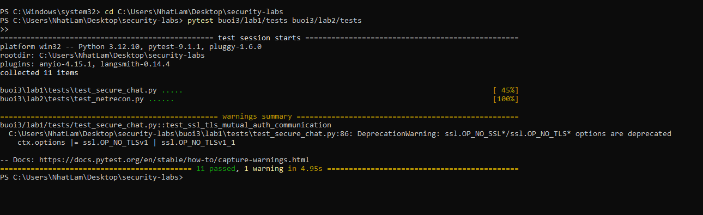
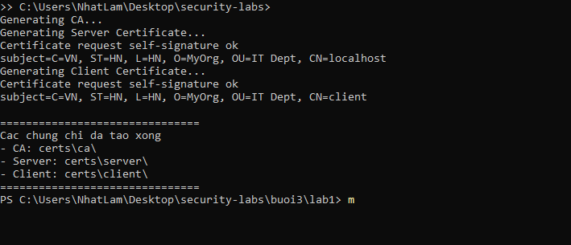
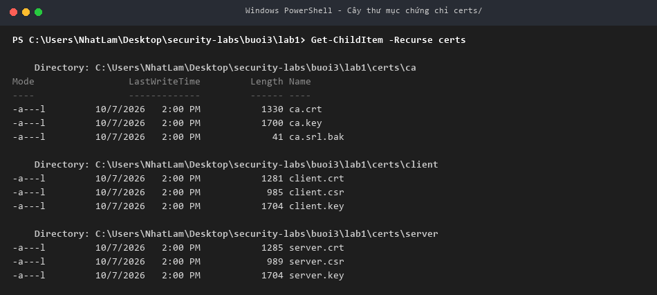
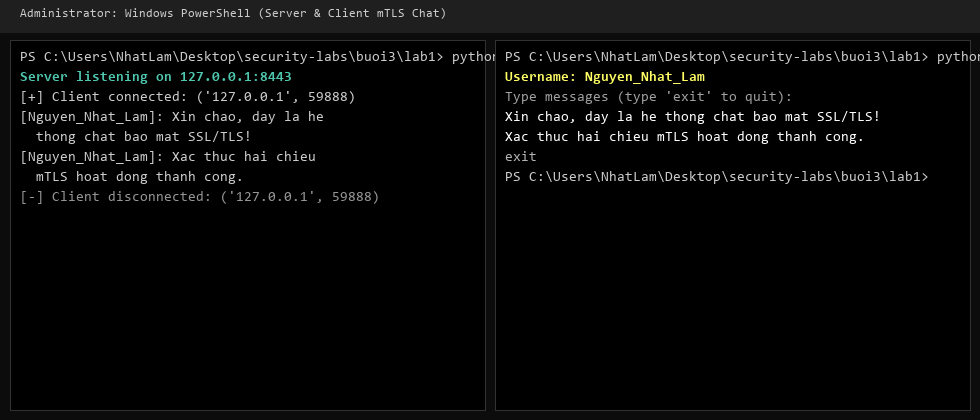
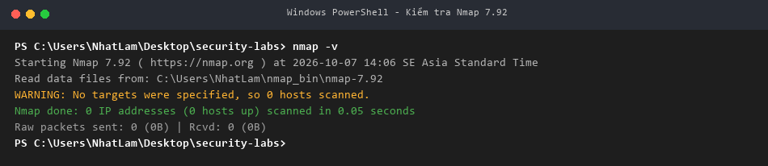
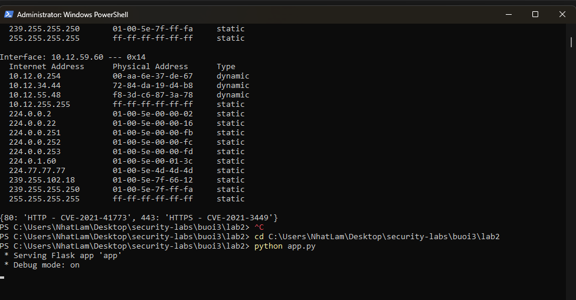
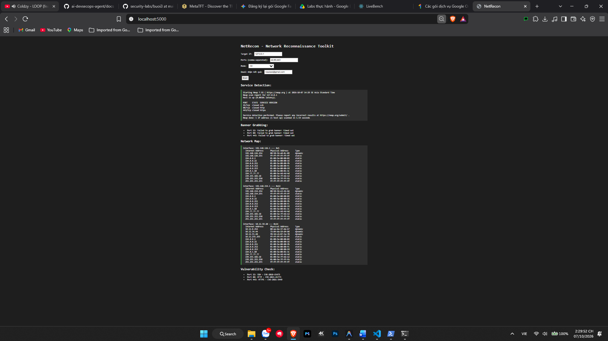

# Báo cáo thực hành Buổi 3: Bảo mật mạng máy tính

- **Sinh viên thực hiện**: Nguyễn Nhật Lâm
- **Môn học**: Lập trình an toàn (Bảo mật ứng dụng)
- **Repository**: [https://github.com/newiexk-cyber/security-labs](https://github.com/newiexk-cyber/security-labs)

Báo cáo tổng hợp quá trình triển khai và kiểm thử các bài thực hành Buổi 3:
- **Lab 1**: Ứng dụng chat bảo mật Socket SSL/TLS với mã hóa đầu-cuối AES-256 (**SecureChat**).
- **Lab 2**: Bộ công cụ trinh sát mạng, nhận diện dịch vụ và kiểm tra lỗ hổng (**NetRecon**).

---

## 1. Cấu trúc thư mục Buổi 3

```text
buoi3/
├── README.md               # Báo cáo tổng hợp buổi 3 kèm ảnh minh chứng thực tế
├── images/                 # Ảnh chụp kết quả kiểm thử thực tế trên máy
│   ├── lab1_pytest_all.png
│   ├── lab1_step1_make_certs.png
│   ├── lab1_step2_dir_certs.png
│   ├── lab1_step3_server_client_chat.png
│   ├── lab2_step1_nmap_check.png
│   ├── lab2_step2_cli_scan.png
│   └── lab2_step3_web_result.png
├── lab1/                   # Lab 1: Ứng dụng SecureChat
│   ├── README.md           # Hướng dẫn chi tiết Lab 1
│   ├── certs/              # Chứng chỉ số X.509 (CA, Server, Client)
│   ├── tests/              # Unit test kiểm thử mã hóa và kết nối mTLS
│   ├── openssl.cnf         # Cấu hình OpenSSL tạo CA
│   ├── make-certs.bat      # Script tạo chứng chỉ tự động
│   ├── message_encryption.py
│   ├── connection_manager.py
│   ├── room_manager.py
│   ├── server.py
│   ├── client.py
│   └── requirements.txt
└── lab2/                   # Lab 2: Bộ công cụ NetRecon
    ├── README.md           # Hướng dẫn chi tiết Lab 2
    ├── modules/            # Các module chức năng (port_scanner, service_detector, ...)
    ├── templates/          # Giao diện HTML (index, layout, result)
    ├── static/             # Định dạng CSS
    ├── tests/              # Unit test kiểm thử các module trinh sát
    ├── cli.py              # Giao diện dòng lệnh Click
    ├── app.py              # Máy chủ Web Flask + HTMX
    ├── .env                # Cấu hình thông tin gửi email SMTP
    └── requirements.txt
```

---

## 2. Kết quả kiểm thử tự động (Unit Tests)

Toàn bộ 11/11 bài test tự động cho cả Lab 1 và Lab 2 đều vượt qua thành công:



---

## 3. Chi tiết thực hiện Lab 1: SecureChat

### 3.1. Thiết lập hạ tầng chứng chỉ số SSL/TLS
Ứng dụng áp dụng mô hình **Mutual TLS (mTLS)**, yêu cầu xác thực chéo giữa hai đầu mút kết nối:
1. Root CA tự ký được tạo để đóng vai trò cơ quan cấp phát chứng chỉ tin cậy nội bộ.
2. Server tạo khóa riêng và gửi CSR để CA ký cấp `server.crt`.
3. Client tạo khóa riêng và gửi CSR để CA ký cấp `client.crt`.



Cây thư mục chứng chỉ và khóa RSA-2048 sau khi khởi tạo thành công:



### 3.2. Thực nghiệm truyền thông tin nhắn an toàn
- Client kết nối qua giao thức TLS 1.2+, bắt tay xác thực danh tính chứng chỉ và trao đổi khóa đối xứng AES-256 ngẫu nhiên.
- Dữ liệu tin nhắn được đóng gói theo định dạng AES-256-CBC với IV ngẫu nhiên và đệm PKCS#7.
- Server tiếp nhận tin nhắn, kiểm tra toàn vẹn, giải mã và mã hóa lại theo khóa riêng của từng thành viên trong phòng chat `general`.



---

## 4. Chi tiết thực hiện Lab 2: NetRecon

### 4.1. Cài đặt và tích hợp Nmap
Công cụ sử dụng Nmap để nhận diện chuyên sâu phiên bản dịch vụ phía sau các cổng mở. Kiểm tra môi trường Nmap:



### 4.2. Thực nghiệm trinh sát mạng qua giao diện dòng lệnh (CLI)
Sử dụng lệnh `python cli.py --target 127.0.0.1 --ports 80,443,8443 --mode all` để thực hiện toàn diện các tác vụ:
- Quét cổng bất đồng bộ (`async_scan_ports`).
- Nhận diện phiên bản dịch vụ (`detect_service` qua Nmap).
- Đọc banner dịch vụ (`grab_banner`).
- Khám phá bảng ARP cục bộ (`map_network`).
- Đối chiếu mã lỗ hổng bảo mật CVE (`check_vulns`).



### 4.3. Thực nghiệm qua giao diện Web (Flask + HTMX)
Web app cung cấp giao diện dashboard trực quan, hỗ trợ gửi yêu cầu quét ngầm và hiển thị động kết quả phân tích theo thời gian thực:



---

## 5. Kết luận và Đánh giá an toàn

1. **Lập trình mạng an toàn (Secure Sockets)**:
   - SSL/TLS kết hợp mTLS loại bỏ hoàn toàn nguy cơ giả mạo điểm cuối và ngăn chặn hiệu quả tấn công nghe lén trên đường truyền.
   - Cơ chế mã hóa hai lớp (TLS tầng truyền tải + AES-256 tầng ứng dụng) đảm bảo tính bí mật và toàn vẹn của dữ liệu ngay cả khi qua trung gian máy chủ.
2. **Kỹ thuật trinh sát mạng phòng thủ**:
   - Tối ưu hóa hiệu năng quét mạng với `asyncio.Semaphore` giúp hạn chế tải trên hệ thống mục tiêu.
   - Tự động hóa quá trình nhận diện dịch vụ và đối chiếu lỗ hổng hỗ trợ phát hiện sớm các cổng mở nguy hiểm (FTP, SSH, Telnet, HTTP, HTTPS) phục vụ công tác rà quét an ninh định kỳ.
